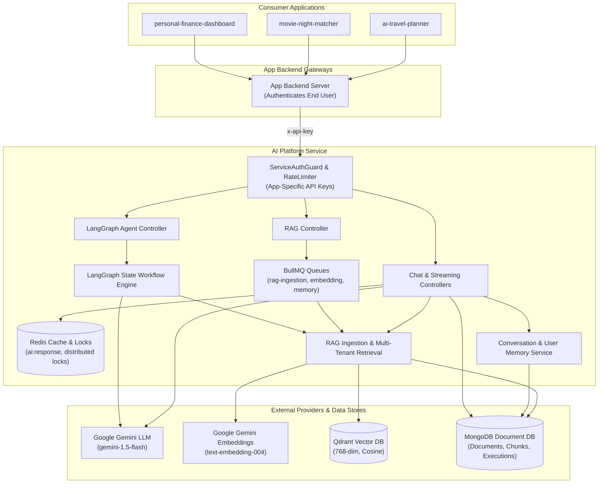
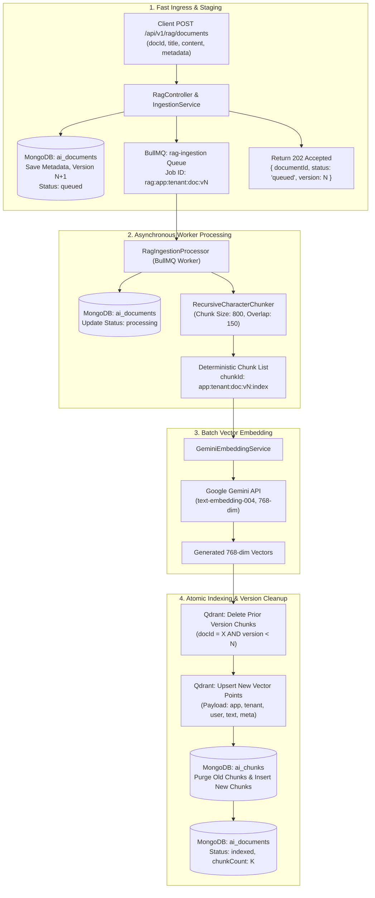
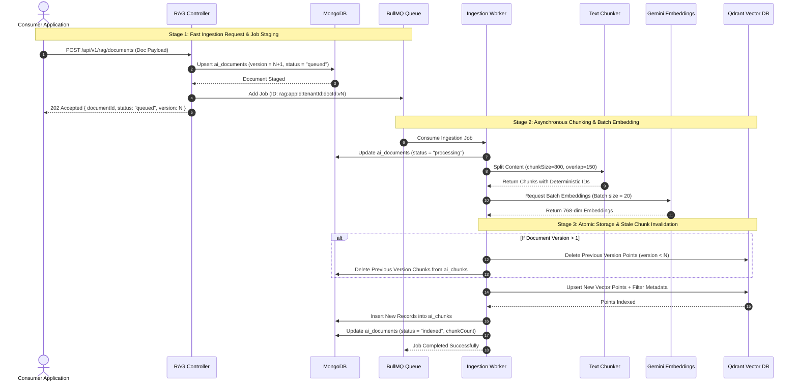
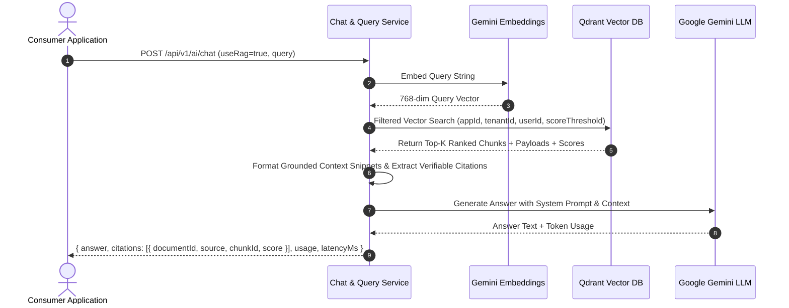
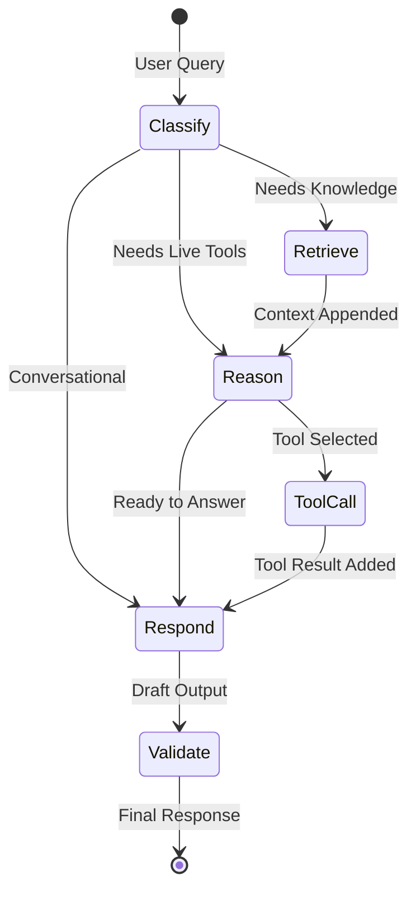

# Portfolio AI Platform Service

> **Enterprise-grade, application-agnostic AI backend service powered by TypeScript, Node.js, NestJS, Google Gemini, LangChain JS, LangGraph JS, Redis, BullMQ, Qdrant, and MongoDB.**

---

## Table of Contents

1. [Project Overview](#1-project-overview)
2. [Why This Service Exists](#2-why-this-service-exists)
3. [Architecture](#3-architecture)
4. [Architecture Diagram](#4-architecture-diagram)
5. [RAG Architecture](#5-rag-architecture)
6. [RAG Ingestion Flow](#6-rag-ingestion-flow)
7. [RAG Query Flow](#7-rag-query-flow)
8. [LangChain Architecture](#8-langchain-architecture)
9. [LangGraph Architecture](#9-langgraph-architecture)
10. [Redis Architecture](#10-redis-architecture)
11. [BullMQ Architecture](#11-bullmq-architecture)
12. [MongoDB Schema](#12-mongodb-schema)
13. [Qdrant Schema](#13-qdrant-schema)
14. [Multi-Tenancy & Isolation](#14-multi-tenancy--isolation)
15. [Security](#15-security)
16. [Authentication](#16-authentication)
17. [API Documentation](#17-api-documentation)
18. [Local Setup](#18-local-setup)
19. [Docker Setup](#19-docker-setup)
20. [Environment Variables](#20-environment-variables)
21. [Gemini Setup](#21-gemini-setup)
22. [Qdrant Setup](#22-qdrant-setup)
23. [Redis Setup](#23-redis-setup)
24. [Testing](#24-testing)
25. [CI/CD Pipeline](#25-cicd-pipeline)
26. [Production Deployment](#26-production-deployment)
27. [Performance Considerations](#27-performance-considerations)
28. [Caching Strategy](#28-caching-strategy)
29. [Retry Strategy](#29-retry-strategy)
30. [Failure Scenarios & Resilience](#30-failure-scenarios--resilience)
31. [Observability & Telemetry](#31-observability--telemetry)
32. [RAG Evaluation Framework](#32-rag-evaluation-framework)
33. [Cost Considerations](#33-cost-considerations)
34. [Future Improvements](#34-future-improvements)

---

## 1. Project Overview

`portfolio-ai-platform` is a centralized, high-performance AI backend designed to serve multiple independent consumer applications across diverse domains:

1. **ai-travel-planner** (Itineraries, hotel recommendations, packing guides)
2. **movie-night-matcher** (Movie suggestions, preferences, reviews)
3. **live-sports-tracker** (Game summaries, player stats, commentary analysis)
4. **campus-study-spot-finder** (Library guides, quiet zones, coffee spots)
5. **habit-garden-tracker** (Habit coaching, accountability reflections)
6. **concert-festival-finder** (Festival lineups, ticketing policies, travel logistics)
7. **coffee-shop-finder** (Wifi ratings, work-friendly cafe indexes)
8. **hiking-trail-explorer** (Trail conditions, gear recommendations, safety alerts)
9. **personal-finance-dashboard** (Expense analysis, budget categorization)

The platform is **application-agnostic**. It contains **zero** domain-specific business logic. Instead, client backend services supply their context (`applicationId`, `tenantId`, `userId`, documents, tools, prompts) while the platform provides unified AI infrastructure:
- LLM inference & streaming (Google Gemini)
- Embedding generation (Gemini Embeddings)
- Production RAG pipeline with strict multi-tenant vector retrieval (Qdrant)
- Agent workflow execution with LangGraph state graphs
- Multi-tier memory (sliding conversation windows + structured long-term user memories)
- Distributed caching and locking (Redis)
- Resilient asynchronous background processing (BullMQ)
- Observability and benchmark evaluations

---

## 2. Why This Service Exists

When building multiple AI-driven applications, engineering teams frequently duplicate foundational AI plumbing:
- Fragmented vector database connections and non-standardized chunking.
- Inconsistent security boundaries leading to data leakage across tenants or users.
- Fragile LLM rate limit handling, lack of retries, and high latency.
- Disconnected memory implementations and redundant token consumption.

This platform consolidates all AI capabilities into a single, scalable, audited, and resilient service-to-service backend.

---

## 3. Architecture

```
+-------------------------------------------------------------+
|                     Client Application                      |
+-------------------------------------------------------------+
                              |
                              v
+-------------------------------------------------------------+
|             Consumer Application Backend (Auth)             |
|   (Authenticates end-user, assigns tenantId & userId)       |
+-------------------------------------------------------------+
                              |
                              | Authenticated Service-to-Service Request
                              | [Header: x-api-key]
                              v
+=============================================================+
|                      AI Platform Service                    |
|                                                             |
|  +---------------------+  +-------------------------------+ |
|  | ServiceAuthGuard    |  | CorrelationId / Pino Logging  | |
|  +---------------------+  +-------------------------------+ |
|  | Throttler (RateLim) |  | Global Exception Sanitizer    | |
|  +---------------------+  +-------------------------------+ |
|                                                             |
|  [ Modules ]                                                |
|  - Chat Engine & SSE Streaming                              |
|  - RAG Ingestion & Multi-Tenant Retrieval Engine            |
|  - LangGraph Generic Agent Orchestrator                     |
|  - Memory Management (Sliding History & Long-Term Memory)   |
|  - Prompt Management & Versioning                           |
|  - AI Response Caching & Distributed Locks                  |
|  - Automated RAG Quality Evaluations                        |
+=============================================================+
      |               |             |             |
      v               v             v             v
+-----------+   +-----------+ +-----------+ +-----------+
|  Gemini   |   |   Redis   | |   Qdrant  | |  MongoDB  |
|  LLM &    |   |  Cache,   | |  Vector   | | Metadata, |
| Embedding |   |  Locks &  | |   Store   | | History & |
|    API    |   |  BullMQ   | | (Cosine)  | | Executions|
+-----------+   +-----------+ +-----------+ +-----------+
```

---

## 4. Architecture Diagram



---

## 5. RAG Architecture

The Retrieval-Augmented Generation (RAG) architecture is decoupled into two distinct pipelines:
1. **Asynchronous Ingestion Pipeline**: Handles document normalization, recursive chunking, batch embedding generation, stale version invalidation, vector indexing, and metadata persistence via BullMQ.
2. **Synchronous Query Pipeline**: Executes query embedding, multi-tenant filtered vector search with tenant/user isolation, context formatting, and citation generation.

---

## 6. RAG Ingestion Flow

The ingestion pipeline is designed for **high throughput, idempotency, and zero client blocking**. Client requests receive an immediate `202 Accepted` acknowledgement while document chunking, embedding, and vector indexing happen asynchronously with automatic retries.

### 6.1 Ingestion Pipeline Architecture



### 6.2 Detailed Sequence Diagram



### 6.3 Ingestion Lifecycle Breakdown

| Stage | Action | Description |
|---|---|---|
| **1. Validation & Staging** | Controller & MongoDB | Validates payload, increments document version, stores document in `ai_documents` with `status: "queued"`. |
| **2. Idempotent Enqueuing** | BullMQ | Creates a job with deterministic ID `rag:{appId}:{tenantId}:{docId}:v{version}` with 3 automatic exponential retries. |
| **3. Recursive Chunking** | `RecursiveCharacterChunker` | Normalizes text and creates chunks bounded by `RAG_CHUNK_SIZE` (800 chars) with `RAG_CHUNK_OVERLAP` (150 chars). |
| **4. Batch Embedding** | Gemini API | Embeds chunks in batches of 20 using `text-embedding-004` to minimize latency. |
| **5. Stale Version Purge** | Qdrant & MongoDB | Atomically purges prior version chunks (`version < N`) to prevent duplicate or stale search results. |
| **6. Vector & Chunk Storage** | Qdrant & MongoDB | Upserts 768-dim vector points with multi-tenant payload filters into Qdrant and saves chunk entities to `ai_chunks`. |
| **7. Final Confirmation** | MongoDB | Updates document record with `status: "indexed"` and total chunk count. |

---

## 7. RAG Query Flow



---

## 8. LangChain Architecture

LangChain JS is leveraged for:
- Standardized message abstraction (`HumanMessage`, `AIMessage`, `SystemMessage`).
- Dynamic prompt templates and parameter variable interpolation.
- Chat model bindings with structured output constraints.
- Tool schemas and dynamic structured tools.

---

## 9. LangGraph Architecture

The agent workflow engine uses `@langchain/langgraph` to construct a state machine (`AgentState`):



**State Nodes:**
- **classify**: Evaluates intent using structured generation to determine if RAG or tools are needed.
- **retrieve**: Executes multi-tenant RAG search.
- **reason**: Evaluates whether external registered tools must be executed.
- **tool_call**: Dynamically executes tools registered in `ToolRegistry`.
- **validate**: Inspects response quality and safety.
- **respond**: Generates the final synthesized answer.

---

## 10. Redis Architecture

Redis is utilized as a centralized high-speed cache and coordination engine:
- **Semantic/Response Cache**: Key schema `ai:response:{applicationId}:{tenantId}:{userId}:{hash}`.
- **Distributed Locks**: Key schema `ai:lock:{resource}` with atomic Lua script release.
- **Queue Broker**: Powers BullMQ queues with reliable acknowledgment.
- **Rate Limiting**: Throttler token bucket tracking.

---

## 11. BullMQ Architecture

BullMQ manages asynchronous workloads across dedicated queues:
1. `rag-ingestion`: Ingests, chunks, embeds, and indexes documents.
2. `embedding`: Processes batch embedding generation.
3. `memory`: Extracts user preferences and attributes asynchronously from conversation turns.
4. `ai-generation`: Handles background or asynchronous AI generation jobs.
5. `cleanup`: Prunes stale vectors, orphan chunks, and expired cache locks.

All jobs feature:
- **Deterministic Job IDs** (`rag:{applicationId}:{tenantId}:{documentId}:v{version}`) to prevent duplicate processing.
- **Exponential Backoff Retries**: 3 attempts with 2s initial delay.

---

## 12. MongoDB Schema

The platform persists documents, chunks, conversations, messages, memories, prompts, and execution logs in MongoDB.

### Collections & Indexes
1. `ai_documents`:
   - `[applicationId, userId, documentId]` (Compound Index)
   - `[applicationId, documentType]` (Compound Index)
   - `[tenantId, applicationId]` (Compound Index)
   - `[documentId, version]` (Compound Index)
2. `ai_chunks`:
   - `chunkId` (Unique Index)
   - `[documentId, documentVersion]` (Compound Index)
   - `[applicationId, tenantId]` (Compound Index)
   - `[tenantId, applicationId, userId]` (Compound Index)
3. `conversations`:
   - `conversationId` (Unique Index)
   - `[tenantId, applicationId, userId]` (Compound Index)
   - `[applicationId, userId]` (Compound Index)
4. `messages`:
   - `messageId` (Unique Index)
   - `[conversationId, createdAt]` (Compound Index)
   - `[tenantId, applicationId, userId]` (Compound Index)
5. `user_memories`:
   - `[tenantId, applicationId, userId, key]` (Unique Compound Index)
   - `[tenantId, applicationId, userId]` (Compound Index)
6. `ai_executions`:
   - `requestId` (Unique Index)
   - `[applicationId, tenantId, createdAt]` (Compound Index)
7. `prompts`:
   - `[applicationId, promptName, version]` (Unique Compound Index)
   - `[applicationId, promptName, isActive]` (Compound Index)

---

## 13. Qdrant Schema

- **Collection Name**: `ai_platform_documents` (configurable via `QDRANT_COLLECTION`).
- **Vector Dimension**: `768` (configurable via `EMBEDDING_DIMENSION`).
- **Distance Metric**: `Cosine`.
- **Payload Keyword Indexes**:
  - `applicationId`
  - `tenantId`
  - `userId`
  - `documentId`
  - `documentVersion`
  - `documentType`
  - `visibility` (`public`, `tenant`, `user`)

---

## 14. Multi-Tenancy & Isolation

The platform enforces multi-tenancy at every layer:
1. **Network & Ingress**: Incoming requests are validated via service-to-service credentials.
2. **RAG Vector Search**: All Qdrant queries apply a boolean filter combining:
   - `applicationId == <currentApp>`
   - `tenantId == <currentTenant>`
   - `visibility IN ['public', 'tenant']` OR `(visibility == 'user' AND userId == <currentUser>)`
3. **Conversations & History**: Scoped strictly by `tenantId`, `applicationId`, and `userId`.
4. **Cache Keys**: Include application, tenant, and user identifiers to prevent cache pollution.

---

## 15. Security

- **Helmet**: Secures HTTP headers.
- **CORS**: Configurable cross-origin resource sharing.
- **Service Authentication**: `ServiceAuthGuard` validates application-specific API keys (`AI_PLATFORM_TRAVEL_API_KEY`, `AI_PLATFORM_MOVIE_API_KEY`, `AI_PLATFORM_SPORTS_API_KEY`, `AI_PLATFORM_STUDY_API_KEY`, plus legacy fallback) using constant-time comparison (`crypto.timingSafeEqual`).
- **Credential Protection**: Zero credentials in code, logs, or client responses.
- **Sanitized Exception Filter**: Redacts internal stack traces and prompt structures.
- **Rate Limiting**: IP and service key throttling via `@nestjs/throttler`.

---

## 16. Authentication

Client application backends authenticate end-users, then call the AI Platform using the `x-api-key` header (or `Authorization: Bearer <key>`) with their designated application credential.

### Application Credentials
| Application | Environment Variable | Service Identifier |
|---|---|---|
| `ai-travel-planner` | `AI_PLATFORM_TRAVEL_API_KEY` | `travel` |
| `ai-movie-matcher` | `AI_PLATFORM_MOVIE_API_KEY` | `movie` |
| `ai-sports-tracker` | `AI_PLATFORM_SPORTS_API_KEY` | `sports` |
| `ai-study-spot-finder` | `AI_PLATFORM_STUDY_API_KEY` | `study` |
| *Legacy Fallback* | `AI_SERVICE_API_KEY` | `legacy-fallback` |

```http
POST /api/v1/ai/chat HTTP/1.1
Host: ai-platform.local
Content-Type: application/json
x-api-key: your-application-specific-key
x-correlation-id: 7f3b610c-967a-4284-95da-78c77eb05943

{
  "applicationId": "ai-travel-planner",
  "tenantId": "tenant-101",
  "userId": "usr-8890",
  "message": "Find boutique hotels in Shibuya under $200"
}
```

---

## 17. API Documentation

Interactive Swagger documentation is available at `/docs`.

### Core Endpoints

| Method | Endpoint | Description | Status Code |
|---|---|---|---|
| `POST` | `/api/v1/ai/chat` | Synchronous AI chat with RAG, Memory, and Cache | `200 OK` |
| `POST` | `/api/v1/ai/chat/stream` | Server-Sent Events (SSE) AI streaming | `200 OK` |
| `POST` | `/api/v1/ai/agents/run` | Execute LangGraph multi-step agent workflow | `200 OK` |
| `POST` | `/api/v1/rag/documents` | Asynchronously ingest document into vector index | `202 Accepted` |
| `DELETE` | `/api/v1/rag/documents/:documentId` | Delete document and vector chunks | `200 OK` |
| `POST` | `/api/v1/rag/query` | Direct vector search with metadata filtering | `200 OK` |
| `POST` | `/api/v1/ai/evaluation/run` | Run automated RAG quality evaluation suite | `200 OK` |
| `GET` | `/health` | Basic service ping | `200 OK` |
| `GET` | `/health/live` | Kubernetes liveness probe | `200 OK` |
| `GET` | `/health/ready` | Readiness probe (MongoDB, Redis, Qdrant) | `200 OK` / `503` |

---

## 18. Local Setup

### Prerequisites
- Node.js `v20+` or `v22+`
- Docker & Docker Compose
- Google Gemini API Key

### Steps
1. Clone the repository and install dependencies:
   ```bash
   npm install --legacy-peer-deps
   ```
2. Create your environment file:
   ```bash
   cp .env.example .env
   ```
   Add your valid `GEMINI_API_KEY` in `.env`.
3. Start infrastructure (MongoDB, Redis, Qdrant):
   ```bash
   docker compose up -d mongodb redis qdrant
   ```
4. Start the NestJS application in development mode:
   ```bash
   npm run start:dev
   ```
5. Open Swagger UI at `http://localhost:4000/docs`.

---

## 19. Docker Setup

To run the full stack (AI Platform + MongoDB + Redis + Qdrant) inside Docker:

```bash
# 1. Export Gemini API Key
export GEMINI_API_KEY="your-gemini-api-key"

# 2. Build and launch all containers
docker compose up --build -d

# 3. Check health
curl http://localhost:4000/health/ready
```

---

## 20. Environment Variables

| Variable | Default | Description |
|---|---|---|
| `NODE_ENV` | `development` | Runtime environment (`development`, `production`, `test`) |
| `PORT` | `4000` | Application HTTP port |
| `API_PREFIX` | `api/v1` | Global API prefix |
| `LOG_LEVEL` | `info` | Pino log level |
| `AI_PLATFORM_TRAVEL_API_KEY` | (optional) | Credential for ai-travel-planner |
| `AI_PLATFORM_MOVIE_API_KEY` | (optional) | Credential for ai-movie-matcher |
| `AI_PLATFORM_SPORTS_API_KEY` | (optional) | Credential for ai-sports-tracker |
| `AI_PLATFORM_STUDY_API_KEY` | (optional) | Credential for ai-study-spot-finder |
| `AI_SERVICE_API_KEY` | (optional) | Comma-separated legacy fallback service API keys |
| `MONGODB_URI` | `mongodb://...` | MongoDB connection string |
| `REDIS_URL` | `redis://localhost:6379` | Redis connection URL |
| `QDRANT_URL` | `http://localhost:6333` | Qdrant REST URL |
| `QDRANT_API_KEY` | (empty) | Qdrant API Key (if cloud-hosted) |
| `QDRANT_COLLECTION` | `ai_platform_documents` | Main Qdrant collection name |
| `GEMINI_API_KEY` | (required) | Google Gemini API Key |
| `GEMINI_MODEL` | `gemini-1.5-flash` | Gemini model name |
| `GEMINI_EMBEDDING_MODEL` | `text-embedding-004` | Gemini embedding model |
| `EMBEDDING_DIMENSION` | `768` | Embedding vector dimension |
| `RAG_CHUNK_SIZE` | `800` | Character chunk size |
| `RAG_CHUNK_OVERLAP` | `150` | Character chunk overlap |
| `RAG_TOP_K` | `5` | Default number of vector chunks to retrieve |
| `RAG_MIN_SCORE` | `0.5` | Minimum cosine similarity threshold |
| `AI_CACHE_ENABLED` | `true` | Enable Redis response caching |
| `AI_CACHE_TTL_SECONDS` | `300` | Redis response cache TTL |
| `THROTTLE_TTL` | `60000` | Throttler time window in ms |
| `THROTTLE_LIMIT` | `120` | Max requests per time window |

---

## 21. Gemini Setup

1. Obtain an API key from Google AI Studio ([https://aistudio.google.com/](https://aistudio.google.com/)).
2. Set `GEMINI_API_KEY` in `.env`.
3. Models can be customized via `GEMINI_MODEL` (e.g. `gemini-1.5-pro` or `gemini-1.5-flash`).

---

## 22. Qdrant Setup

- Default local port: `6333` (HTTP) and `6334` (gRPC).
- On platform startup, `QdrantVectorStoreService` automatically checks and initializes the collection and creates payload keyword indexes for multi-tenant fields.

---

## 23. Redis Setup

- Default local port: `6379`.
- Used concurrently by `ioredis` for AI cache/distributed locks and by `BullMQ` for queue processing.

---

## 24. Testing

### Run Unit Tests
```bash
npm test
```

### Run E2E Integration Tests
```bash
npm run test:e2e
```

### Run Coverage Report
```bash
npm run test:cov
```

---

## 25. CI/CD Pipeline

The `.github/workflows/ci.yml` pipeline runs on every push and pull request:
1. Starts MongoDB, Redis, and Qdrant container services.
2. Installs dependencies (`npm ci --legacy-peer-deps`).
3. Runs linter (`npm run lint`).
4. Executes unit test suite (`npm test`).
5. Executes end-to-end test suite (`npm run test:e2e`).
6. Builds the production bundle (`npm run build`).

---

## 26. Production Deployment

- Run using the multi-stage `Dockerfile`.
- Set `NODE_ENV=production`.
- Configure managed database clusters (MongoDB Atlas, Redis Cloud/ElastiCache, Qdrant Cloud).
- Use container orchestrators (Kubernetes, AWS ECS, GCP Cloud Run) targeting `/health/live` and `/health/ready`.

---

## 27. Performance Considerations

- **SSE Streaming**: Sends tokens with zero buffering for instantaneous time-to-first-token.
- **Batch Embeddings**: Chunks are embedded in batches of 20 to minimize HTTP round-trips.
- **Connection Pooling**: Mongoose and ioredis maintain persistent connection pools.
- **Indexed Payloads**: Qdrant payload filters run on pre-indexed keyword fields.

---

## 28. Caching Strategy

1. **Deterministic Request Hashing**: Sha256 hash of `input + systemPrompt + model + temperature`.
2. **Strict Multi-Tenant Scoping**: User-specific queries are scoped by `userId`, preventing cross-user cache hits.
3. **Selective Cache Bypass**: Sensitive financial or private endpoints set `cacheable: false`.

---

## 29. Retry Strategy

- **BullMQ Exponential Backoff**: Ingestion jobs automatically retry up to 3 times with exponential backoff on transient network or rate limit errors.
- **Idempotent Ingestion**: Job ID format `rag:{appId}:{tenantId}:{docId}:v{version}` ensures no document version is processed more than once.

---

## 30. Failure Scenarios & Resilience

| Scenario | Behavior |
|---|---|
| Gemini API Rate Limit (429) | Caught by `GeminiLLMProvider`, mapped to HTTP 429; async queues retry with backoff. |
| Redis Unavailable | Caching fails open (requests bypass cache without crashing); locks fail gracefully. |
| Qdrant Unavailable | Chat continues gracefully with empty RAG context; `/health/ready` reports 503. |
| MongoDB Unavailable | Handled with HTTP 500; `/health/ready` reports 503. |

---

## 31. Observability & Telemetry

Every AI execution is recorded in the `ai_executions` collection with:
- `requestId` (correlation ID)
- `applicationId`, `tenantId`, `userId`
- `operation` (`chat`, `agent_run`, `rag_query`)
- `model`
- `latencyMs`
- `tokenUsage` (`promptTokens`, `completionTokens`, `totalTokens`)
- `cacheHit` (boolean)
- `retrievalCount` (number of chunks retrieved)
- `status` (`success`, `cached`, `failure`)

---

## 32. RAG Evaluation Framework

Automated benchmark evaluation endpoint: `POST /api/v1/ai/evaluation/run`.
Evaluates 4 core dimensions on a scale of `0.0` to `1.0`:
1. **Retrieval Relevance**: Relevance of vector chunks to the input question.
2. **Context Relevance**: Sufficiency of context to answer the question.
3. **Answer Relevance**: Faithfulness and accuracy of the generated answer compared to ground truth.
4. **Citation Correctness**: Verification that claims are supported without hallucinations.

---

## 33. Cost Considerations

- **Gemini 1.5 Flash**: Delivers sub-second latency with low per-token cost.
- **Redis Semantic Caching**: Eliminates 30-60% of repetitive knowledge queries.
- **Sliding Window History**: Retains the last 8-10 messages plus a summary, bounding conversation token growth.

---

## 34. Future Improvements

- MongoDB Atlas Vector Search adapter for `VectorStoreFactory`.
- Hybrid search (BM25 + Dense vector embeddings with reciprocal rank fusion).
- Fine-grained semantic reranking (e.g. Cohere or BGE Reranker).
- OpenTelemetry tracing exporters.

---

## License

UNLICENSED. Portfolio Enterprise Platform.
